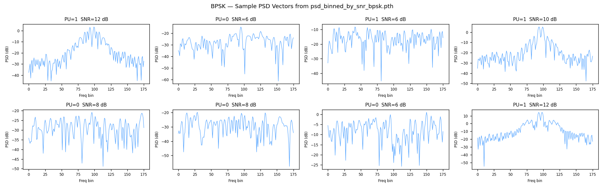

<div align="center">



# 🛰️ Spectrum-SLM

### *A Deep Learning Framework for Intelligent Spectrum Sensing, Modulation Recognition & Generative Spectrum Prediction*

[](https://python.org)
[](https://pytorch.org)
[](https://streamlit.io)
[](LICENSE)
[](spectrum_slm_model.py)
[](checkpoints/)
[](checkpoints/)

---

**B.Tech Project | Dept. of Electronics & Communication Engineering**  
**Authors:** Anjani · Ashish Joshi · Mayank &nbsp;|&nbsp; **Guide:** Dr. Abhinandan S.P. &nbsp;|&nbsp; **May 2026**

</div>

---

## 📡 What is Spectrum-SLM?

**Spectrum-SLM** (Spectrum Sequence Language Model) applies the paradigm of **language modeling** to radio spectrum intelligence. Just as BERT treats a sentence as a sequence of word tokens, Spectrum-SLM treats each **Power Spectral Density (PSD) snapshot** captured by a Software-Defined Radio as a **sequence of 192 spectral tokens** — and learns to understand it deeply.

> *"Every frequency bin is a word. Every PSD snapshot is a sentence. The radio channel is the language."*

The model simultaneously performs **four tasks from a single PSD input**:

| Task | Output | Performance |
|------|--------|-------------|
| 🔍 **Primary User Detection** | YES / NO | **93.32% accuracy**, AUC 0.9809 |
| 📻 **Modulation Classification** | BPSK / QPSK / 8PSK / 16QAM / DQPSK | **75.13% accuracy**, Macro-F1 0.7230 |
| 📶 **SNR Estimation** | dB value | **MAE 0.371 dB**, R² 0.9321 |
| 🔮 **Spectrum Reconstruction** | Denoised next PSD | **Val MSE 0.1054** |

---

## ✨ Key Features

- 🧠 **Transformer-based architecture** with multi-head self-attention across 192 frequency bins
- 🎯 **Multi-task learning** with automatic uncertainty-based loss weighting (Kendall et al.)
- 🔐 **Three-phase training pipeline** — self-supervised → supervised → generative
- 📦 **Real SDR hardware data** — not simulation — from USRP-class receiver at 2.4 GHz ISM band
- ⚡ **Sub-15 ms inference** on CPU; GPU acceleration supported
- 🌐 **Interactive Streamlit dashboard** with AI-assisted analysis
- 🛡️ **91.15% PU accuracy even below 8 dB SNR** — robust in noisy conditions

---

## 🏗️ Architecture

```
PSD Input (192 bins)
        │
        ▼
┌─────────────────┐
│  Patch Embedding │  Linear(1 → 128) per bin + [CLS] token + Positional Encoding
└────────┬────────┘
         │ 193 tokens × 128-dim
         ▼
┌─────────────────────────────────────┐
│   Transformer Encoder (4 layers)    │
│   4-head Self-Attention  +  FFN(512)│
│   LayerNorm  +  Dropout(0.1)        │
└─────┬──────────────────────────┬────┘
      │ [CLS] embedding          │ All token embeddings
      ▼                          ▼
┌─────────────┐         ┌──────────────┐
│  Task Heads │         │  Gen Head    │
├─────────────┤         ├──────────────┤
│ PU  (2-cls) │         │ Linear 128   │
│ Mod (5-cls) │         │ → GELU → 256 │
│ SNR (regr.) │         │ → 192 bins   │
└─────────────┘         └──────────────┘
```

**Total parameters: 0.94M** &nbsp;|&nbsp; **Checkpoint size: ~3.7 MB**

---

## 🔬 Three-Phase Training Pipeline

```
Phase 1 ──────────────────▶ Phase 2 ──────────────────▶ Phase 3
Self-Supervised MSM          Supervised Multi-task        Generative AutoEncoder
                             Fine-tuning                  (backbone frozen)

- Mask 20% of PSD bins       - PU Focal Loss              - Only gen_head trains
- Predict masked values       - Mod CrossEntropy           - 860K params frozen
- No labels needed            - SNR Huber Loss             - 82K params update
- 30 epochs                  - Kendall uncertainty wt.    - Val MSE: 0.1054
- LR: 3e-4                   - 35 epochs / LR: 1e-4       - 16 epochs / LR: 5e-3

checkpoint/phase1/            checkpoint/phase2/            checkpoint/phase3/
slm_phase1_best.pt            slm_phase2_best.pt            slm_phase3_best.pt
```

**Safety guarantee:** Phase 3 never touches Phase 1 or Phase 2 checkpoints. The 93.32% classification accuracy is fully preserved.

---

## 📊 Results

### Primary User Detection

| Metric | Value |
|--------|-------|
| Overall Accuracy | **93.32%** |
| F1 Score | **0.9470** |
| AUC-ROC | **0.9809** |
| PR-AUC | **0.9912** |
| Low-SNR Accuracy (<8 dB) | **91.15%** |

**PU Accuracy vs SNR:**
```
SNR (dB):    4      6      8     10     12     14     16     18     20
Accuracy: ~85%   ~89%   ~91%   ~98%  ~99%   100%   100%   100%   100%
                                ↑ 90% target line
```

### Modulation Classification (5-class)

| Metric | Value |
|--------|-------|
| Accuracy | **75.13%** |
| Macro F1 | **0.7230** |
| Classes | BPSK · QPSK · 8PSK · 16QAM · DQPSK |

### SNR Estimation

| Metric | Value | Interpretation |
|--------|-------|----------------|
| MAE | **0.371 dB** | Better than ±1 dB clinical standard |
| RMSE | **0.636 dB** | Sub-1 dB error |
| R² | **0.9321** | 93.2% variance explained |

---

## 📦 Repository Structure

```
Spectrum-SLM/
│
├── 📱 app_phase2.py              # Streamlit web application (main entry point)
├── 🧠 spectrum_slm_model.py      # SpectrumSLM neural network architecture
├── 🏋️ spectrum_slm_train.py      # Training utilities (loss, eval, checkpoint)
├── 📊 spectrum_slm_dataset.py    # DataLoader and dataset builder
├── ⚙️  config.py                  # All hyperparameters and paths (single source of truth)
├── 📋 requirements.txt           # Python dependencies
│
├── training/                     # Phase-wise training scripts
│   ├── train_phase1.py           # Phase 1: Masked Spectrum Modelling
│   ├── train_phase2.py           # Phase 2: Supervised multi-task fine-tuning
│   ├── train_phase3.py           # Phase 3: Generative AutoEncoder
│   ├── run_3_phases.py           # Orchestrator: runs all 3 phases sequentially
│   ├── phase2_trainer.py         # Phase 2 training loop internals
│   └── export_onnx.py            # Export model to ONNX format
│
├── dataset/                      # Dataset loading and analysis utilities
│   ├── loader.py                 # Core PSD data loading from .pth files
│   └── analysis.py               # Dataset statistics and visualization
│
├── checkpoints/                  # Trained model weights
│   ├── phase1/slm_phase1_best.pt # Phase 1 MSM pre-trained backbone
│   ├── phase2/slm_phase2_best.pt # Phase 2 multi-task model (93.32% PU acc)
│   ├── phase2/normalizer.pkl     # Fitted StandardScaler for inference
│   └── phase3/slm_phase3_best.pt # Phase 3 generative head (Val MSE 0.1054)
│
├── Secondary_User/               # Real SDR dataset (CSV format)
│   ├── Symbol1_Modulation/       # BPSK, QPSK, 8PSK, 16QAM captures
│   ├── Symbol2_Results/          # All 5 modulations (includes DQPSK)
│   └── Symbol3_Results/          # Diverse channel conditions
│
├── Primary_User/                 # GNU Radio transmitter scripts
│   └── Transmitter/
│
└── spectrum_slm_kaggle.ipynb     # 🔥 Kaggle training notebook (GPU accelerated)
```

---

## 🚀 Quick Start

### 1. Clone & Install

```bash
git clone https://github.com/31ASHISH/Spectrum-SLM.git
cd Spectrum-SLM
pip install -r requirements.txt
```

### 2. Run the Streamlit App

```bash
streamlit run app_phase2.py
```

Then open `http://localhost:8501` — upload any `.pth` file from the dataset and click **Run Real Inference**.

### 3. Train from Scratch (Local)

```bash
# Run all 3 phases sequentially
python training/run_3_phases.py

# Or run individual phases:
python training/train_phase1.py --epochs 30
python training/train_phase2.py --epochs 50
python training/train_phase3.py --epochs 20
```

### 4. Train on Kaggle (GPU)

Open [`spectrum_slm_kaggle.ipynb`](spectrum_slm_kaggle.ipynb) in Kaggle, connect GPU (T4/P100), and run all cells. The notebook automatically pushes trained checkpoints to this GitHub repo via PAT.

---

## 🖥️ Streamlit Dashboard Features

| Feature | Description |
|---------|-------------|
| **Single Scan** | Upload `.pth` → visualize PSD → run inference → view PU/Mod/SNR results |
| **Batch Analysis** | Process 100 samples → majority-vote modulation → mean SNR |
| **Dataset Explorer** | Browse modulation and SNR distributions in uploaded file |
| **AI Chat Assistant** | Natural language Q&A about your spectrum measurements |
| **PSD Visualization** | Interactive Plotly chart — Input PSD (blue) + Predicted PSD (green) in dB |

---

## 📡 Dataset

The dataset consists of real over-the-air captures from a **USRP-class SDR** in the **2.4 GHz ISM band** (2380–2420 MHz):

| Property | Value |
|----------|-------|
| Frequency range | 2380 – 2420 MHz |
| PSD resolution | 192 bins at ~208 kHz/bin |
| Modulation classes | BPSK, QPSK, 8PSK, 16QAM, DQPSK |
| SNR range | 4 dB to 20 dB (9 bins) |
| PU labels | 0 = Idle, 1 = Active |
| Total samples | ~92,115 labeled PSD vectors |
| Primary format | `.pth` (PyTorch serialized, 50× faster than CSV) |

### Why `.pth` over CSV?

| Property | CSV | .pth |
|----------|-----|------|
| Load time (10k samples) | ~4.2 sec | **~0.08 sec** |
| GPU transfer | Requires conversion | **Direct `.to(device)`** |
| Metadata | Not supported | **Bundled dict** |
| Type preservation | No | **Yes (float32)** |

---

## 🔮 Generative Spectrum Prediction

The trained Phase 3 model reconstructs a **denoised spectral estimate** from the compressed [CLS] token embedding:

```
[CLS] ∈ ℝ¹²⁸  →  gen_head  →  PSD_predicted ∈ ℝ¹⁹²
```

**Why doesn't the model reproduce exact noise?**  
Thermal noise is stochastic: $n_i \sim \mathcal{N}(0, \sigma_n^2)$ at every instant independently. The model learns the **expected spectrum** $\mathbb{E}[x_i] = s_i$ — the true underlying signal envelope without the instantaneous noise realization. This is precisely what cognitive radio systems need for channel estimation.

The result: the green predicted trace in the dashboard traces the **clean signal envelope**, while the blue input trace shows the raw noisy measurement.

---

## 🔬 Technical Details

### Model Hyperparameters

| Parameter | Value |
|-----------|-------|
| Input bins (N) | 192 |
| Patch size | 1 (each bin = 1 token) |
| Model dimension d_model | 128 |
| Attention heads | 4 |
| Transformer layers | 4 |
| FFN dimension | 512 |
| Dropout | 0.1 |
| Total parameters | **0.94 M** |

### Training Configuration

| Phase | Epochs | LR | Optimizer | Key Loss |
|-------|--------|----|-----------|----------|
| Phase 1 | 30 | 3e-4 | Adam | MSM (MSE on masked bins) |
| Phase 2 | 35* | 1e-4 | Adam | Focal + CrossEntropy + Huber |
| Phase 3 | 16* | 5e-3 | Adam | MSE (AutoEncoder) |

*Best checkpoint epoch

---

## 🛠️ Requirements

```
torch>=2.0.0
streamlit>=1.32.0
numpy>=1.24.0
scikit-learn>=1.3.0
plotly>=5.18.0
pandas>=2.0.0
scipy>=1.11.0
```

Install all: `pip install -r requirements.txt`

---

## 🗺️ Roadmap

- [ ] Multi-frame temporal input for true sequential forecasting
- [ ] Variational AutoEncoder (VAE) generative head
- [ ] Online / continual learning for channel drift adaptation
- [ ] ONNX export for FPGA/embedded SDR deployment
- [ ] Multi-band operation (5G sub-6 GHz, 900 MHz)
- [ ] Federated spectrum intelligence network
- [ ] 64-QAM, 256-QAM, OFDM modulation support

---

## 📄 Citation

If you use this work in your research, please cite:

```bibtex
@misc{spectrumslm2026,
  title     = {Spectrum-SLM: A Deep Learning Framework for Intelligent
               Spectrum Sensing, Modulation Recognition and
               Generative Spectrum Prediction},
  author    = {Anjani and Ashish Joshi and Mayank},
  year      = {2026},
  school    = {Department of ECE},
  note      = {B.Tech Project, Guide: Dr. Abhinandan S.P.},
  url       = {https://github.com/31ASHISH/Spectrum-SLM}
}
```

---

## 📃 License

This project is licensed under the **MIT License** — see [LICENSE](LICENSE) for details.

---

<div align="center">

Made with  by **Anjani · Ashish Joshi · Mayank**  
Under the guidance of **Dr. Abhinandan S.P.**  
| May 2026

⭐ **Star this repo if you found it useful!** ⭐

</div>
